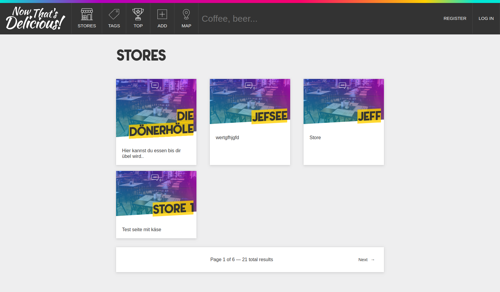

## Finshed the [@WesBos](https://wesbos.com/learn-node/) Course in NodeJs :rocket:

Build with ***node.js*** the application has three main models — Users, Stores and Reviews — all of which are relational. It is designed to hit upon many of today’s application needs such as ***user authentication, database storage, Ajax REST API, file upload and image resizing.***

<p align="center"> 

</p>

## Try this :poop: out! 
 
The online version is uploaded to [@now](https://first-attempt-shop11-mxmrvvmaor.now.sh/)

|Name|Email (login)|Password|
|---|---|---|
|Greek|mister@greek.com|greek|

## Project Info

Webpack is used as the ***Task-Manager***. MongoDB as Database, Moment.js, Passport.js, Multer and Node.js

## Local Version

If you have cloned the repository please run:

```
npm install && npm start
```


